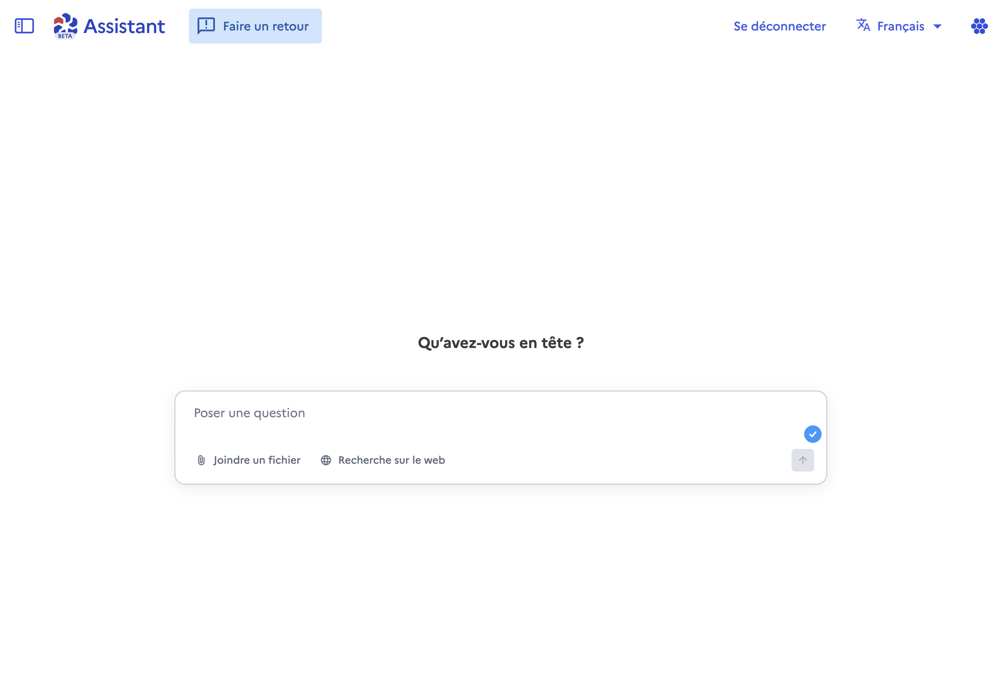

# Guide de l'expérimentateur


Ce guide est à destination des utilisateurs faisant partie de l'expérimentation. Ceux-cis ont été identifiés et contactés par leurs référents IA.&#x20;


## Contexte

L'intelligence artificielle générative offre depuis deux ans des perspectives particulièrement prometteuses, notamment en termes de gains de productivité.

Dans ce contexte, la Direction interministérielle du numérique (DINUM) développe un **assistant conversationnel** (comme Le Chat de Mistral AI ou ChatGPT de OpenAI) souverain, sécurisé et connecté à nos outils internes. Cet outil s'appelle l'**Assistant IA**.

La DINUM a conclu un partenariat avec Mistral AI, visant à tester jusqu'à juin 2026 l’usage de leurs modèles propriétaires dans cet outil, dans une infrastructure dédiée SecNumCloud, en partenariat avec le ministère de l'Économie et l'entreprise Outscale.

Ce projet s’inscrit dans une logique de mutualisation interministérielle, avec la volonté de :

* Offrir un **socle commun d’IA** à plusieurs administrations.
* **Documenter les usages et les besoins réels** des agents publics pour orienter les décisions d’achat à partir de mi-2026.

Si vous lisez ce document, c'est que vous faites partie des **10 000 agents** qui feront partie de cette expérimentation. L'objectif est de distribuer ces accès de manière stratégique pour explorer et évaluer le potentiel de l'IA générative au sein de l'administration.

## Objectifs de l'expérimentation

L'expérimentation vise cinq objectifs principaux :

* **Identifier les modèles les plus adaptés** : évaluer la pertinence et la qualité des réponses de l'assistant selon les contextes d'usage
* **Évaluer la capacité de calcul requise** pour déployer l'outil à l'échelle
* **Optimiser l'ergonomie** : tester l'interface proposée et l'améliorer en continu grâce aux retours utilisateurs
* **Acculturer et développer les compétences** : permettre à un grand nombre d'agents de se familiariser avec les outils d'IA générative dans un cadre sécurisé, de comprendre leur potentiel et leurs limites
* **Identifier les cas d'usage à forte valeur ajoutée** : cartographier les applications concrètes de l'IA générative et mesurer le retour sur investissement (gains d'efficacité, amélioration du service public, etc.) pour justifier un déploiement à plus grande échelle.

## Prise en main de l'outil

L'outil Assistant IA est une nouvelle brique de [la Suite Numérique](https://lasuite.numerique.gouv.fr/), et est un agent conversationnel généraliste, basé sur des grands modèles de languages (LLMs) d'intelligence artificielle. Il est conçu pour être simple et accessible à tous les agents. L'interface web permet une prise en main immédiate des fonctionnalités de dialogue avec les différents modèles, sans nécessiter de compétence technique.

Le principe est simple : **vous discutez directement avec l'Assistant,** comme avec n'importe quel autre assistant conversationnel.

Dans la version mise en ligne au 22/10, vous aurez accès aux fonctionnalités avancées suivantes :

* Modèle propriétaire Mistral
* Analyse et recherche dans les pièces jointes
* Recherche internet

Vous pourrez vous connecter à l'outil via **ProConnect**, en utilisant un code d'accès fourni par votre référent(e) IA. **Ne partagez pas ce code**.

<figure><figcaption></figcaption></figure>

En fonction des progrès du projet, l'équipe anticipe de déployer, en cours d'expérimentation, les fonctionnalités suivantes :

* Connexion à [Docs](https://docs.numerique.gouv.fr/), l'éditeur de texte collaboratif de la Suite Numérique, pour donner du contexte spécifique à votre assistant conversationnel
* Connexion à Fichiers, le _drive de_ la Suite Numérique, pour poser des questions sur ses documents.

**Vous débutez en IA ?**

N'hésitez pas à vous inscrire à la sensibilisation à l'IA générative proposée par le Campus Numérique et l'Inria Academy "[Découvrir les IA génératives](https://www.campus.numerique.gouv.fr/catalogue/d%C3%A9couvrir-les-ia-g%C3%A9n%C3%A9ratives/)" qui vous permettra en une heure de :

* Comprendre l'intérêt de l'IA générative,
* Identifier des usages pour votre quotidien professionnel,
* Expliquer les principes de base du fonctionnement de l'IA générative et en comprendre les limites,
* Lister les bonnes pratiques et vous guider pour rédiger une instruction efficace.

Les **référents IA** pourront aussi vous proposer des ressources pour vous accompagner dans la prise en main de cet outil.

## Exemples d'utilisation

| **Cas d'usage**                   | **Exemple d'instruction détaillé**                                                                                                                                                                                                                                                                                                                                                                                                                                                                                                                                                                                                                                                                                                                                                                                                                                                                                             |
| --------------------------------- | ------------------------------------------------------------------------------------------------------------------------------------------------------------------------------------------------------------------------------------------------------------------------------------------------------------------------------------------------------------------------------------------------------------------------------------------------------------------------------------------------------------------------------------------------------------------------------------------------------------------------------------------------------------------------------------------------------------------------------------------------------------------------------------------------------------------------------------------------------------------------------------------------------------------------------ |
| **Reprise de mail**               | 
<strong>Rôle</strong> : Tu es un assistant de communication expert, spécialisé dans la rédaction de courriels professionnels et diplomatiques. <strong>Objectif</strong> : Ton but est d'analyser et de réécrire un brouillon de courriel pour qu'il soit plus clair, précis et percutant. Tu dois t'assurer que le ton original et l'intention sont parfaitement préservés et même renforcés. <strong>Contexte</strong> : Identifie l'idée principale du message et assure-toi qu'elle est mise en avant. Reformule les phrases complexes ou ambiguës pour les rendre plus limpides. Utilise une syntaxe plus directe et un vocabulaire qui renforce le sens. Corrige les éventuelles erreurs de syntaxe, de grammaire et d'orthographe. Ne modifie en aucun cas le ton du message (tutoiement, formel, informel, amical, professionnel, etc.) ni son sens profond. <em>[Coller votre échange de mail ici].</em>
 |
| **Compte rendu de réunion**       | 
<strong>Rôle</strong> : Tu es un secrétaire expert, capable de synthétiser des discussions complexes en comptes rendus clairs et exploitables. <strong>Objectif</strong> : Rédiger un compte rendu de la réunion en te basant sur la transcription brute ci-dessous. Le compte rendu doit inclure : 1. La liste des participants. 2. Les points clés de la discussion. 3. Les décisions prises. 4. Un tableau récapitulatif des actions à mener avec les responsables et les échéances. <strong>Contexte</strong> : <em>Il s'agit du compte rendu de la réunion de lancement du projet "Alpha" qui s'est tenue ce matin. L'audience de ce CR est l'équipe projet et le comité de pilotage. Le ton doit être formel et factuel. Voici la transcription : [Coller la transcription brute de la réunion ici].</em>
                                                                                                   |
| **Note administrative**           | 
<strong>Rôle</strong> : Tu es un chargé de mission au sein de la direction de la prospective, expert des enjeux numériques. <strong>Objectif</strong> : Rédiger une note d'analyse synthétique (1 page maximum) sur l'impact de l'intelligence artificielle sur le marché du travail. La note doit permettre à ma hiérarchie de saisir rapidement les enjeux. Elle doit présenter un diagnostic clair, identifier trois défis principaux pour notre secteur d'activité et esquisser deux pistes d'action concrètes que notre direction pourrait explorer. <strong>Contexte</strong> : Cette note est destinée à mon directeur en vue de la préparation du prochain comité stratégique. Elle doit être factuelle, structurée et aller à l'essentiel pour faciliter une prise de décision éclairée. Le ton doit être professionnel et orienté vers l'action.
                                                        |
| **Moyenne de notes utilisateurs** | 
<strong>Rôle</strong> : Tu es un analyste de données expert chargé de l'analyse des retours clients. <strong>Objectif</strong> : À partir de la liste de commentaires et de notes d'utilisateurs suivante, tu dois : 1. Calculer la note moyenne sur 5. 2. Identifier les 3 thèmes positifs qui reviennent le plus souvent. 3. Identifier les 3 points de friction ou problèmes les plus fréquents. 4. Rédiger une synthèse d'une phrase résumant le sentiment général des utilisateurs. <strong>Contexte</strong> : Ces commentaires proviennent de la dernière version de notre application mobile. Cette analyse servira à l'équipe produit pour prioriser les prochaines améliorations. Voici les données : [Coller la liste des notes et commentaires ici].
                                                                                                                                                  |
| **Organisation d'une réunion**    | 
<strong>Rôle</strong> : Tu es un facilitateur d'ateliers et un chef de projet expérimenté. <strong>Objectif</strong> : Proposer un ordre du jour détaillé et un plan de déroulement pour un atelier de brainstorming de 2 heures. L'objectif de l'atelier est de trouver des idées de nouvelles fonctionnalités pour notre application. Le plan doit inclure des timings précis, des activités pour chaque phase (icebreaker, idéation, convergence, prochaines étapes) et le matériel nécessaire. <strong>Contexte</strong> : L'atelier réunira 8 personnes : des développeurs, des chefs de produit et des designers. L'ambiance doit être créative et collaborative. Je dois envoyer cet ordre du jour en amont aux participants pour qu'ils puissent se préparer.
                                                                                                                                             |

## Le ou la référent(e) IA

Dans votre administration a été nommé(e) un(e) **référent(e) IA**, dont le but est d'y **organiser** et **piloter l'expérimentation**.

Votre référent(e) sera **votre principal point de contact** tout le long de l'expérimentation, mais il est possible que l'équipe Assistant IA vous contacte directement pour approfondir certaines idées, irritants, ou améliorations.

## Ce qu'on attend de vous

Il est important de rappeler à ce stade que vous faites partie d'une **expérimentation active** (il ne s'agit pas simplement d'avoir accès à l'outil en avant-première).

Il sera donc attendu que :

* vous **incorporiez l'outil à votre quotidien professionnel**, pour exploiter un maximum ses capacités
* vous **remplissiez les divers questionnaires d'évaluation** qui vous seront fournis (maximum 1 / mois)
* vous participiez, occasionnellement, aux webinaires et **sessions de retour d'expérience qualitative**
* vous participiez à **tout autre protocole d'évaluation** proposé par le ou la référent(e) IA de votre administration.

Votre référent(e) vous a choisi(e) car il ou elle juge que vous serez un(e) participant(e)s pertinent(e), actif(ve) et volontaire. Le succès de cette expérimentation (et, _in fine_, du déploiement d'un tel outil dans l'administration) en dépend !

## Calendrier prévisionnel

| **Date / Période**  | **Activité**                                                              |
| ------------------- | ------------------------------------------------------------------------- |
| Septembre-Oct. 2025 | Intégration des ministères partenaires, nomination des référents.         |
| 22 octobre 2025     | Lancement de "l'Assistant IA" propulsé par Mistral AI                     |
| Octobre - décembre  | Ouverture progressive aux expérimentateurs                                |
| Décembre 2025       | Partage des premiers retours.                                             |
| Février 2026        | Déploiement de la connexion à Docs et Fichiers                            |
| Fin février 2026    | Point d'étape à mi-parcours                                               |
| Juin 2026           | Bilan final de l'expérimentation, rédaction et circularisation du rapport |

## Vos points de contact

Comme expliqué plus haut, **votre point de contact principal sera votre référent(e) IA**, nommé au sein de votre administration.

Vous pouvez aussi échanger sur vos retours, idées, cas d'usages ou tout simplement parler d'IA sur [ce canal Tchap](https://www.tchap.gouv.fr/#/room/!eAHyPLdVHMxNhKAbaC).
